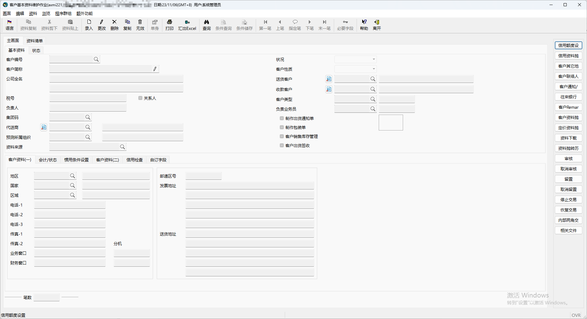
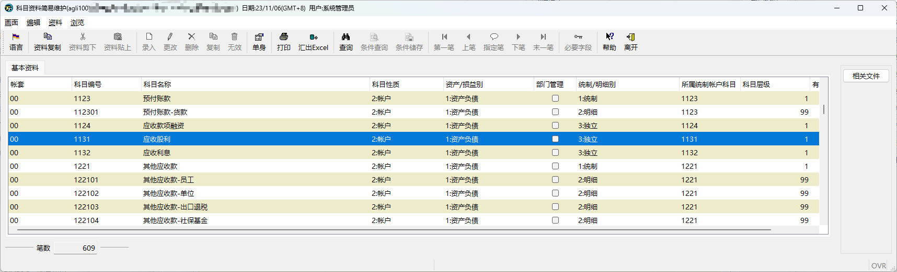
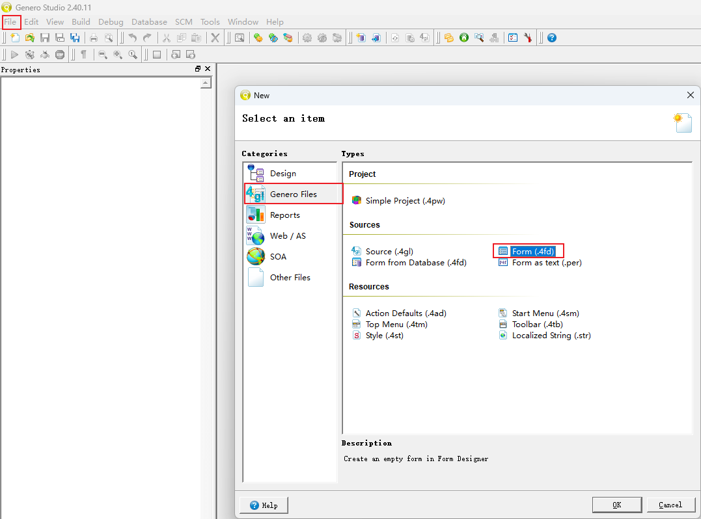
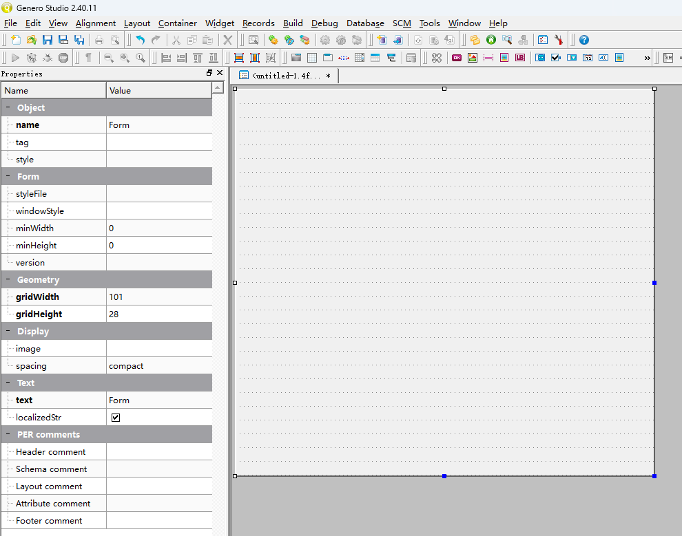
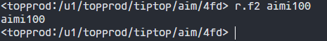
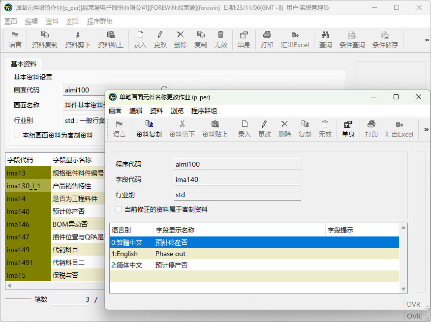

# 规格画面编写

## 复制类似作业

找一个画面类似的作业，将作业对应的4fd文件下载下来修改使用。

### 单档作业

- 表单作业

- 表格作业

### 双档作业

### 查询作业

### 报表作业

## 从零开始

- **新增4fd文件**

- 将需要的控件拖拽到空白画布上

# 画面编译过程

- **r.f2 42f 文件**

- **r.gf 2 p**

预览画面，并将字段说明产生p_per多语言档文件

- **p_per 多语言文档**

