## 布局

布局有两种方式，垂直和水平，多个容器要放在一个布局中

  

    

  

    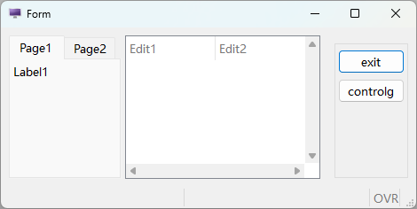

## 容器

|名称|功能说明|
|:-|:-|
|Folder|以切页方式的空白画布|
|Grid|简易空白画布|
|ScrollGrid|有卷轴的空白画布|
|Table|以表格方式显示阵列资料|
|Tree|以层次结构展示的阵列资料|

  

  

  

  

  

  

- Folder

当摆放元件空间不足时（或是需要滚动画面，操作上较麻烦时），即可使用切页的功能，以资料夹的形式将资料性质相近的栏位，切分在同样的 page 当中。

制作时可在页签位置以鼠标右键新增、删除页面。

编译时若该页签内没有任何元件，则编译会失败，且系统会显示有空白页签存在。 页签上显示字符串仍需在属性视窗指定。

  

    Genero Studio 

    

  

    画面预览

    

- Grid

可将此容器视为一块空白的画布，布置在上方的元件都可以显示在画面相对位置上。

Grid 只能处理`非阵列资料`。Grid 不可以被安排在其他 Grid 容器之内。

  

    Genero Studio 

    

  

    画面预览

    

- ScrollGrid

在 Genero Studio 中，此容器与 Grid 相同，均作为处理`非阵列资料`用。与 Grid 容器的差异仅在可使用滚动轴，可以滚动画面。不能用于显示阵列资料。

  

    Genero Studio 

    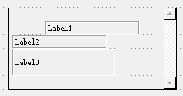

  

    画面预览

    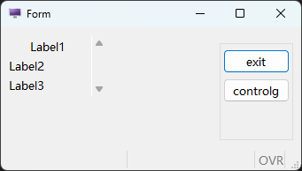

- Table

使用 TABLE 即是以表格方式显示阵列资料，此方式有许多的优点，这些优点都是系统提供的，不需要额外再撰写程序码即可使用；

包含：动态排序、栏位隐藏、显示或移动等。 在设计时期改变 Table 高度时，会自动增减资料的行数。 在 Table 物件上按鼠标右键，在弹出式选单可以新增或移除栏位。

另外可以直接以鼠标拖曳改变栏位的顺序。

编写时须注意：

  - 使用 TABLE 物件时，资料（Record）一定是横列，没有直垂直排列。

  - 编写时须到各栏位的属性中进行形态、对应数据库等资料的设定或变更。

  

    Genero Studio 

    

    

  

    画面预览

    

    

- ~~Tree~~

Tree 树状图预览时和 Table 是一样的，当有资料的资料，树状图是有层级结构的。

当节点展开时，可以展开上下级结构。

  

    Genero Studio 

    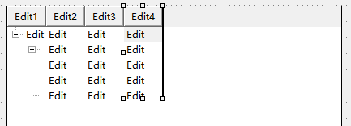

  

    画面预览

    

## 控件

- Label

定义显示值用的栏位，可区分为下列三类。

  - StaticLabel

    静态文字标签，可设定宽度、 前景色等。

  

    

      

    

      

  - Text

    StaticLabel 可以和 Text 相互转换。Text 字符数自动决定大小的基本静态文字标签。无法自行设定宽度。

    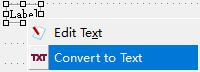

  - FormFieldLabel

    动态标签，代码可以控制值的显示

  

    

      

    

      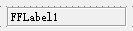

- Edit

  定义一个编辑栏位。属于 FormField 物件，可设定与资料栏位的关联。

  

    

      

    

      

- ButtonEdit

  定义一个编辑栏位的元件，可透过右侧按钮以触发某一事件。通常用在串连与此栏位输入时有关的动作，例如查询合法可用资料等。

  

    

      

      

    

      

- ComboBox

  定义一个可利用下拉功能选值的编辑栏位，若输入资料只有几种值可供选择时，建议采用 RadioGroup 方式来限缩使用者可输入的内容（参阅 RadioGroup）。属于 FormField 物件，可设定与资料栏位的关联。

  

    

      

    

      

  选项对话视窗:

  可管理 ComboBox 的选项，也可以按字母顺序排列选项的 Text。

  

- DateEdit

  定义一个日期编辑，按右侧钮可带出 Client 端万年历选择视窗。日期显示格式由主机端 DBDATE 环境变量控制。

  

    

      

    

      

- CheckBox

  当栏位选项只有两种选择时（如：是或否，0 或 1，100 或 200 等），就可以采用此种输入型态执行输入。

  

    

      

    

      

- HLine

  水平分隔线

  

    

      

    

      

- TextEdit

  定义可编辑多行的栏位，输入长度当超过画面预留长度时，会自动出现卷轴。

  

    

      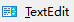

    

      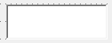

- ~~Button~~

  定义一个按钮以触发某一 4GL 中已写定的 ON ACTION 段。

  建议除了特别的 ACTION 有需要在 Layout 内布置按键外，一般作业可不必布置.

  

    

      

    

      

- ~~RadioGroup~~

  定义一个可用选择方式输入资料的输入栏位，此种选择方式会将选项清单展示在画面上（ComboBox 不会展开显示，可参照 ComboBox 说明），故若需要采用此输入形态，要注意画面空间是否足够。

  

    

      

      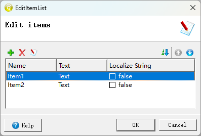

    

      

- ~~Canvas~~

  

    

      

    

      

- ~~ProgressBar~~

  

    

      

    

      

- ~~TimeEdit~~

  

    

      

    

      

- ~~Image~~

- ~~Slider~~

  

    

      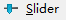

    

      

- ~~SpinEdit~~

  

    

      

    

      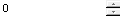

- ~~WebComponent~~

