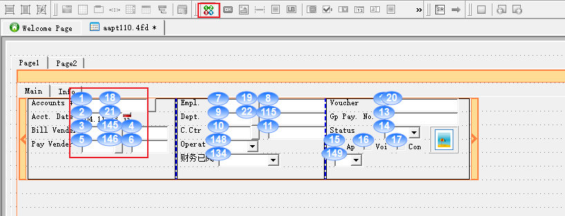

# Structure 结构

## Screen Record 画面字段结构

每一个添加到画面文件中的字段，都会自动添加到record记录上，每个表格会变为一组，不在表格中的字段顺序不需要关注。

表格record 的名称和字段的顺序，是你在4gl代码中使用时要注意的，所以这里顺序需要注意。

# Properties 属性

### name 字段名

字段的名称一般设置为表字段即可，`apa01`、`apa_file.apa01` 都是一样的，`apa_file`是表名，一般不需要，我们自己建立的时候，不需要加表名。

如果字段重复，也可以取其它名称，如果`apa01_1`、或者其它符合标识符规则的命名，如果在程序中要使用这个字段，请使用一个方便使用的字段名。

### posX,poxY 字段位置

### gridWidth，gridHeight 字段大小

字段的大小和位置，一般是我们用鼠标拖动的，但是也可以在这里做微调。

### noEntry 不需录入

### notNull 不为空

### required 必须录入

### case 大小写

设置字段录入时候的属性，设置为大写，录入字母时自动转化为大写

### hidden 隐藏

设置后字段依然存在，但是用户无法看到此字段

### image 图片（buttonEdit使用zoom）

### action （buttonEdit 使用controlp）

只有ButtonEdit控件需要设置这两个数量，image设置开窗按钮的图片，action 是控制什么时候出发开窗这个动作

### items （下拉框等空间使用）

下拉框空间中，可以通过items选项设置下拉框可以使用的元素

### valueCheded、valueUncheked （单选框控件使用）

单选框，选中和未选中可以设置一个值，当选择时为Y，未选中为N。默认为1和0。

### text （单选框等控件使用） 字段名称

单选框还可以设置text，会显示到单选框后

# Tab Order 默认顺序

Tab Order控制在输入时，字段的顺序。当没有4gl代码强制控制字段顺序时，按**entry**或者**tab**键，会按照此序号顺序依次录入。

# 布局

多个容器在同一个层级的时候，需要将他们设置一个布局，垂直或者水平显示。

如果不小心设置错，可以点击布局 **Break Layout**后重新设置

