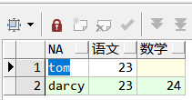
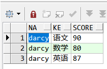
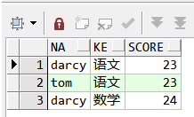
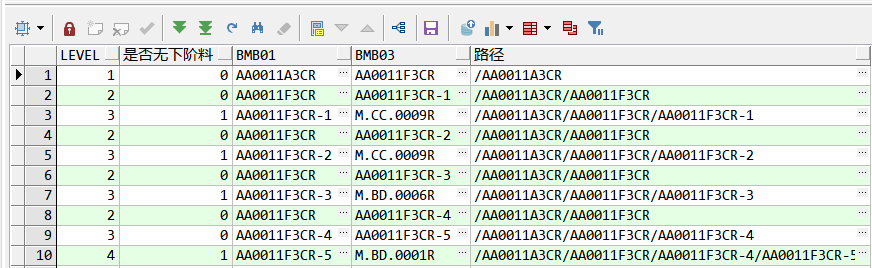
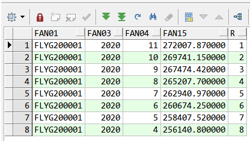
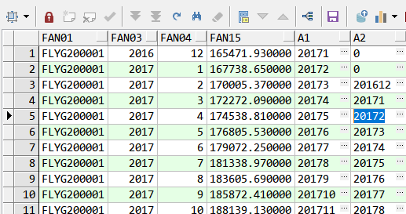
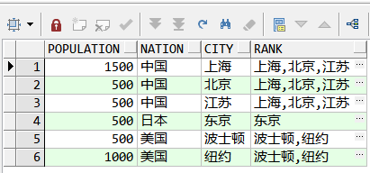

## pivot 函数,列转行

```sql
WITH a AS
 (SELECT 'darcy' na, '语文' ke, 23 score FROM dual),
b AS
 (SELECT 'tom', '语文', 23 FROM dual),
c AS
 (SELECT 'darcy', '数学', 24 FROM dual),
d AS
 (SELECT * FROM a UNION ALL SELECT * FROM b UNION ALL SELECT * FROM c)
SELECT na, 语文, 数学
  FROM (SELECT na, ke, score FROM d)
PIVOT (SUM(score) FOR ke IN('语文' AS 语文, '数学' AS 数学));


```



## unpivot 函数,行转列

```sql
WITH a AS
 (SELECT 'darcy' na, '90' 语文, '80' 数学, '87' 英语 FROM dual)
SELECT na, ke, score FROM a UNPIVOT(score for ke in(语文, 数学, 英语))

```



## with as 临时数据

```sql
WITH a AS
 (SELECT 'darcy' na, '语文' ke, 23 score FROM dual),
b AS
 (SELECT 'tom', '语文', 23 FROM dual),
c AS
 (SELECT 'darcy', '数学', 24 FROM dual),
d AS
 (SELECT * FROM a UNION ALL SELECT * FROM b UNION ALL SELECT * FROM c)
SELECT * FROM d

```



## leading 指定链接表主表顺序

```plain text

```

## connect by 递归

```sql
SELECT LEVEL,
       CONNECT_BY_ISLEAF 是否无下阶料,
       bmb01,
       bmb03,
       SYS_CONNECT_BY_PATH(bmb01, '/')  路径,
       CONNECT_BY_ROOT(bmb01) root
  FROM bmb_file
 WHERE bmb04 <= SYSDATE
   AND (bmb05 IS NULL OR bmb05 > SYSDATE)
 START WITH bmb01 LIKE 'AA0011A3CR' --从这个资料开始
CONNECT BY PRIOR bmb03 = bmb01 --下笔资料的bmb03 和当前bmb01一样

```



## keep函数,最值的基础上取最值

最新良率日期中的最大的单据编号

```sql
SELECT
tc_bmj03,tc_bmj04,MAX(tc_bmj01) KEEP(dense_rank LAST order BY tc_bmj09) max01
FROM tc_bmj_file
WHERE tc_bmj11 ='2'
GROUP BY tc_bmj03,tc_bmj04

```

## over 函数

语法：rank()/dense_rank over(partition by A order by B)

over是一种分析函数，根据字段A对结果进行分区，在各分区内按照字段进行排序；
over不能单独使用，需要与row_number()，rank()和dense_rank，lag()和lead(),sum()等配合使用

说明：

- over()在什么条件之上;

- partition by 按哪个字段划分组；

- order by 按哪个字段排序；
注意：

- 使用rank()/dense_rank() 时，必须要带order by否则非法；

- rank(): 跳跃排序，如果有两个第一级时，接下来就是第三级。

- dense_rank(): 连续排序，如果有两个第一级时，接下来仍然是第二级。

```sql
SELECT fan01,
       fan03,
       fan04,
       fan15,
       dense_rank() OVER(PARTITION BY fan01 ORDER BY fan03 DESC, fan04 DESC) r
  FROM fan_file
 WHERE fan041 IN ('0', '1')
   AND fan05 IN ('1', '2')
   AND fan01 = 'FLYG200001'

```



根据年,月倒叙排序产生r列

## lead()/lag() over(partition by ... order by ...)

偏移量函数

```sql
SELECT fan01,
       fan03,
       fan04,
       fan15,
			 LAG(fan03||fan04) OVER (ORDER BY fan03 DESC ,fan04 DESC) a1,
			 LAG(fan03||fan04,2,0) OVER (ORDER BY fan03,fan04) a2
  FROM fan_file
 WHERE fan041 IN ('0', '1')
   AND fan05 IN ('1', '2')
   AND fan01 = 'FLYG200001'
	 ORDER BY fan03,fan04

```

可以查询上几条数据,下几条数据,适合查上下站资料



## instr 字符串匹配函数

```sql
SELECT
  INSTR('123456789','2'), -- 返回：2
  INSTR('123456654321','66'), -- 返回：6
  INSTR('123456654321','66',6), -- 返回：6
  INSTR('123456654321','66',8), -- 返回：0
  INSTR('11223344','2',1,2), -- 返回：4
  INSTR('11223344','2',2,3), -- 返回：0
  INSTR('11223344','2',-1,2), -- 返回：3
  INSTR('11223344','2',-6,1), -- 返回：3
  INSTR('11223344','2',-6,2) -- 返回：0
 FROM DUAL ;

```

## nulls last/first null值排序

跟在order by 之后

- Nulls first则表示null值的记录将排在最前

- Nulls last则表示null值的记录将排在最后

## 集合操作

- Union：对两个结果集进行并集操作，不包括重复行，同时进行默认规则的排序；

- Union All：对两个结果集进行并集操作，包括重复行，不进行排序；

- Intersect：对两个结果集进行交集操作，不包括重复行，同时进行默认规则的排序；

- Minus：对两个结果集进行差操作，不包括重复行，同时进行默认规则的排序。

## listagg 聚合列为一条记录

```sql
LISTAGG(字段名,',') WITHIN GROUP( ORDER BY 字段名)

```

```sql
listagg(字段名,',') within GROUP (order by 字段名) over (partition by 字段名) rank

```

```sql
with temp as(
select 500 population, '中国' nation ,'江苏' city from dual union all
select 1500 population, '中国' nation ,'上海' city from dual union all
select 500 population, '中国' nation ,'北京' city from dual union all
select 1000 population, '美国' nation ,'纽约' city from dual union all
select 500 population, '美国' nation ,'波士顿' city from dual union all
select 500 population, '日本' nation ,'东京' city from dual
)
select population,
nation,
city,
listagg(city,',') within GROUP (order by city) over (partition by nation) rank
from temp

```



