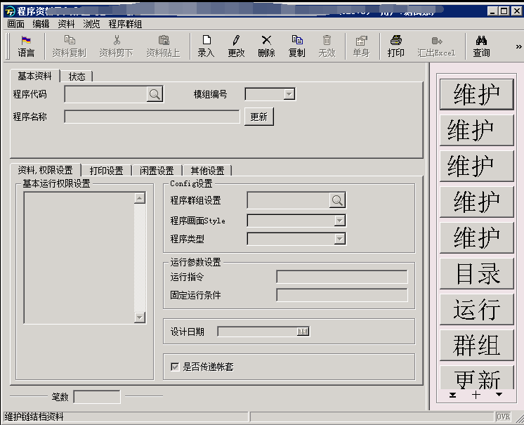

# DISPLAY 触发不了 DEFORE DISPLAY问题

利用page 标签 action 属性触发


# 主动触发row change

```4gl
IF g_sfdc_d[l_ac].sfdc005 != g_sfdc_d_o.sfdc005 END IF
    CALL DIALOG.setFieldTouched("s_detail2.*", TRUE)
END IF
```

# 修改部分字体大小

- 找到4st文件目录，此文件影响所有作业格式，修改前务必备份


- 修改4st文件，增加Menu的字体大小，还可以修改颜色，字体类型等


修改后如下



其它字段可以自己摸索，'Menu'关键字是根据，DEBUG TREE找到，CTRL+右键 画面空白处可打开。


# 取当前时间

```4gl
DEFINE d1, d2 DATETIME YEAR TO FRACTION(3)
LET d1 = CURRENT YEAR TO FRACTION(3) 
LET d2 = "1998-01-23 12:34"
DISPLAY d1, d2
YEAR
MONTH
DAY
HOUR
MINUTE
SECOND
FRACTION
FRACTION(1)
FRACTION(2)
FRACTION(3)
FRACTION(4)
FRACTION(5)
```

# **fglWrt 授权查询**

`fglWrt -a info`


# **sed 截取文件**

`sed -n '100,200p'  123.xml >> 12.xml `
将`123.xml` 中从100行到200行内容复制到`12.xml`这个文件中。

<aside>
💡 用处：大文件日志，不方便下载，其中的报文又不好复制的时候，可以用这个命令将需要的内容切割出来.
</aside>


# **grep 命令**

- 直接用就是查询所有匹配内容

- 参数 -l

`grep -l "hello,world!"  file_name`

- 参数 **-wo**

`grep -wo "keyword" filename |wc -l`

- 参数 -rn 这个参数可以查询匹配的文件名和所在行数

`grep -rn "hello,world!" file_name`


# 修改日期格式

```shell
export DBDATE=Y4MD/

设置debug时，日期变为'yyyy/mm/dd'格式，不设置为'yy/mm/dd'
```

