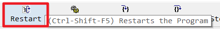
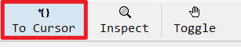
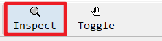

# 如何DEBUG TIPTOP ERP作业

# 如何DEBUG TIPTOP ERP作业

## 是否有权限DEBUG

debug需要tiptop账号，如果你没有tiptop账号登陆权限，则无法debug erp作业。

有root权限也是可以切换到tiptop账号的。 su - tiptop 即可切换到tiptop账号，注意有两个空格。

## 环境准备

- 登陆服务器

使用tiptop 登陆到ERP服务器，登陆到要测试的区。

- 打开画面测试

我们在服务器打开任意erp作业，exe p_zz r.r azzi910。如果能打开作业，环境没有问题，否则要检查下端口是否正常。

- 端口异常

GDC的默认端口为6400，如果你的端口不是6400，则需要在服务器上指定一下端口， export FGLSERVER=$FGLSERVER:6401

## 运行前目录检查

debug时，我们也是通过调用42r文件运行作业的，所以不同目录我们可能运行不同作业。

- T100

r.d azzi910 可以自动识别作业注册的目录，不用特意设置起始目录。（特殊情况可以切换到作业4gl目录下，使用r.dg azzi910，避免作业运行错误）

- TIPTOP GP 

我们要确保切换到要运行的作业4gl目录，运行 r.d2+ p_zz 开始debug作业。（42m等其它目录也可以，一般默认到4gl目录）

## DEBUG画面介绍

### 查询代码

**ctrl+F**，可以弹出查询代码行数位置，可以跳转到指定代码位置，此方式只能查询当前代码位置

### 重新运行

重新启动，即相当于重新打开作业

### 运行

**F5 **运行到下一个断点处，如果没有断点，会一直运行到作业关闭

### 进入函数

**F11** 进入函数，当前行如果有调用函数，使用此方式，可以进入函数内部

### 跳出函数

**Shift+F11 **跳出函数，跳出当前运行的函数，如果时main函数，相当于运行到下一个断点

### 单步运行

**F10** 可以单步运行，如果当前行有函数，会自动执行完函数，不会自动进入

### 运行到下个断点

和F5功能差不多

### 监测变量值

**Ctrl+I **，弹出变量监测窗口，你可以查看变量当前值，也可以将变量增加到监测窗口

### 增加断点

在选中行增加或取消断点，快捷键F9，或者鼠标双击

## DEBUG 命令

bdl中支持一些命令，可以方便debug，这里说一些比较常用的类型，更多类型可以看帮助文档。

在画面中指定debug命令，要打开命令窗口运行，快捷键Ctrl+D，也可以在菜单Run→Execute Debugger Command

## 指定函数断点

`b cl_cp_r 会在cl_cp_r`函数第一行下一个断点

## 改变变量的值

`set variable g_user='tiptop’ `强行改变变量的值

## 当变量值变化时自动暂停

`watch g_user if g_user='tiptop’` ，当g_user变量变为’tiptop‘时，自动暂停

