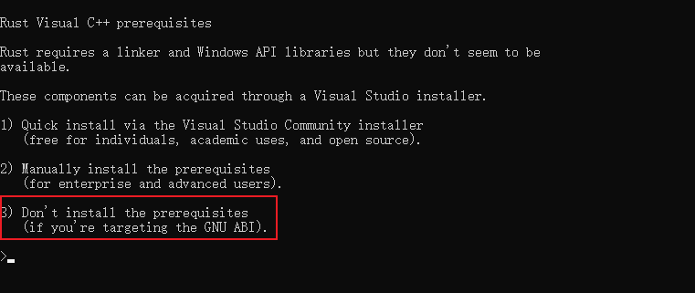
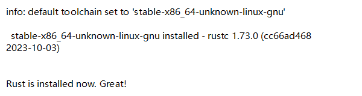
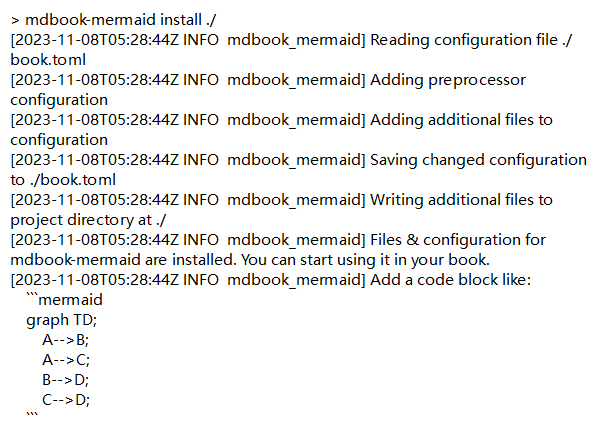

# mdbook安装过程

# windows 安装

- RUST 官网下载 rustup-init.exe，linux系统按照sh文件安装

(https://www.rust-lang.org/)[https://www.rust-lang.org/]

不安装多余文件，选择3然后安装RUSTUP。

-  安装默认cargo

检查是否安装成功

- 安装mdbook

`cargo install mdbook`

- 以上为windows安装方式，发现安装时缺少很多文件，放弃，因为不想用mdbook需要安装一个vs。后面是linux 的教程，系统是ubuntu。

`rustup self uninstall`，卸载已安装的rustup

# linux 安装

-  安装rust

- 安装mdbook

`cargo install mdbook`

- WSL2 使用本机proxy

`export ALL_PROXY=“http://192.168.1.1:7890”` 192.168.1.1是本机的IP

- 在需要的目录初始化mdbook

`mdbook init`

## mdbook 使用

- <code>mdbook build</code>

发布为html，默认为book目录

`dbook build `**`--dest-dir`**** 指定目的文件夹**

- <code>mkbook watch</code>

实时转为html

- <code>mkbook serve</code>

打开网页服务，并实时显示

- <code>mkbook clean</code>

清除已build的内容

### mermaid 插件安装

- <code>cargo install mdbook-mermaid</code>

- 安装到要使用的目录

`mdbook-mermaid install ./`

- 额外语言支持

theme/highlight.js 使用此文件替换mdbook默认文件

