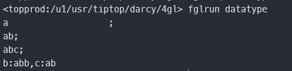
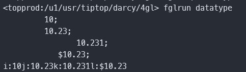
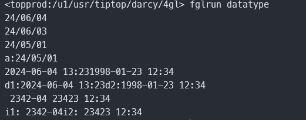
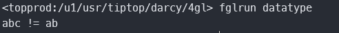

## 字符串

- CHAR[(n)]

- VARCHAR[(n[,r])]

- STRING

```sql
define a char(20)
define b varchar(20)
define c string
let a = 'a'
let b = 'ab'
let c = 'abc'
display a,';'
display b,';'
display c,';'
let b = b,'b'
let c = c.substring(1,2)
display sfmt("b:%1,c:%2",b,c)
```



## 数字

- BIGINT

- INTEGER

- SMALLINT

- TINYINT

- FLOAT[(p)]

- SMALLFLOAT

- DECIMAL[(p[,s])]

- MONEY[(p[,s])]

```sql
    define i integer
    define j float
    define k decimal(20,3)
    define l money(15,2)
    
    let i = 10.231
    let j = 10.231
    let k = 10.231
    let l = 10.231
    display i,";"
    display j,";"
    display k,";"
    display l,";"
    display sfmt("i:%1j:%2k:%3l:%4",i,j,k,l)
```



## 时间

- DATE

- DATETIME

- INTERVAL

```sql
define a date
    define d1, d2 datetime year to minute
    define i1 interval year to month
    define i2 interval day(5) to minute

    let a = today
    display a
    let a = today - 1
    display a
    let a = '24/05/01'
    display a
    display sfmt("a:%1",a)
    
    let d1 = current year to minute 
    let d2 = "1998-01-23 12:34"
    display d1, d2
    display sfmt("d1:%1d2:%2",d1,d2)

    
    let i1 = "2342-4"
    let i2 = "23423 12:34"
    display i1, i2
    display sfmt("i1:%1i2:%2",i1,i2)
```



## 其它

- BOOLEAN

```sql
   	define a int, b boolean
    let b = (a == 0)
    if not b then
        display "a != 0"
    end if
    let b = "abc" = "ab"
    if not b then
        display "abc != ab"
    end if
```



- BYTE

- TEXT

```sql
    # 仅做代码演示，此代码无法运行
    define b byte
    database stock
    locate b in memory
    select png_image into b from images where image_id = 123
    call b.writefile("/tmp/image.png")
```


常用类型：varchar、string、decimal、date、boolean、integer


