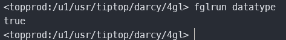
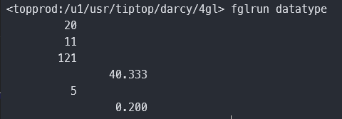
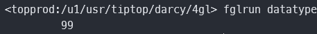

## 关系表达式

- AND OR NOT

- TRUE FALSE

- 大小比较

- 是否空

```sql
   	define r, c integer
    define b boolean
    
    let c = 4
    let r = ( false!=false ) and ( c=2 or c=4 )
    if r then
        display "ok"
    end if

    let b = ( true and false )
    if b then
        display "true"
    end if

    let r = null
    if r is null then
        display "true"
    end if

    let c = 4
    let r = 4 + (1==0)    -- result is 4.
```



## 算数处理

- 加减乘除

- 求余数

- 幂运算

```sql
 		define a integer
    define b,c  decimal(20,3)

    let a = 10
    let a = a + 10
    display a
    let a = a - 9
    display a

    let a = a * a
    display a

    let b = a / 3
    display b

    let a = b mod 7
    display a

    let c = a ** -1
    display c
```



## 字符串处理（非STRING类型）

- 拼接

- 截取

- 格式化

```sql

```

## 字符串处理（STRING类型)

- 截取

## 日期计算

- 日期加减

- 赋值

- 取年月日

## 三元表达式

```sql
    define a integer
    let a = 1
    let a = iif (a>0,99,-99)
    display a
```




