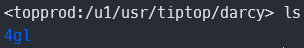
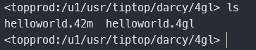
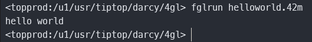
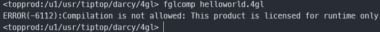

## 准备工作目录

避免影响正常作业，请在服务器上新建一个工作目录，之后所有的练习代码都可以放到此目录下。



我的工作目录为`/u1/usr/tiptop/darcy`，目录下面有一个目录`4gl`，用来放4gl代码。

## 新建代码文件

```sql
main
    display 'hello world'
end main
```

将文件上传到服务器工作目录/4gl目录下，或者直接在服务器新建也可以。

## 编译运行

- fglcomp helloworld.4gl 编译文件



编译成功后，目录下会产生一个42m文件。BDL是一门编译语言，42m即编译后的执行文件。

- fglrun helloworld.42m 运行作业



如果你编译作业有以下报错，需要将环境切换到测试模式。



切换到测试模式

```shell
FGLDIR=/u1/genero/fgl.dev
```


