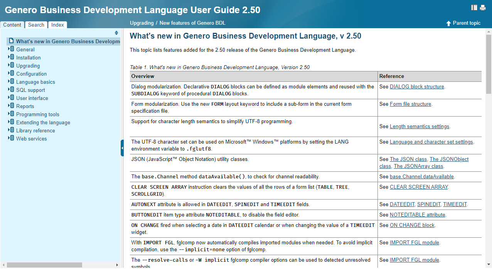
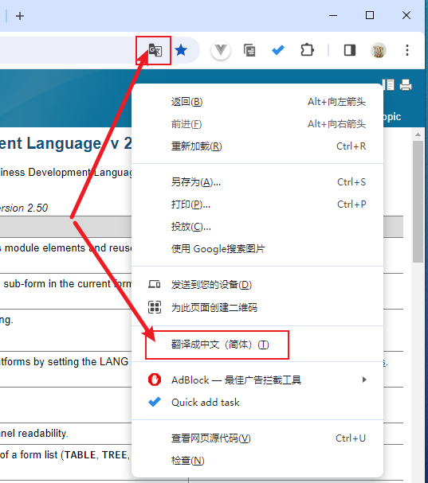
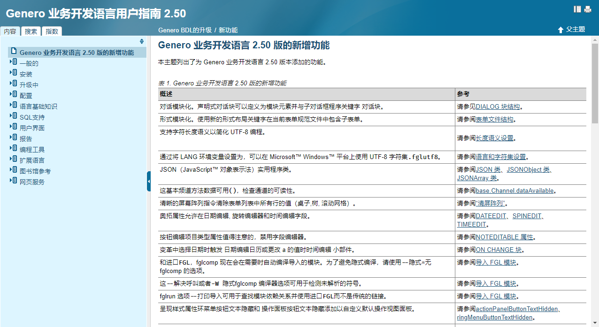
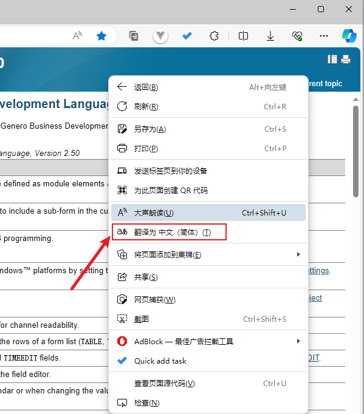
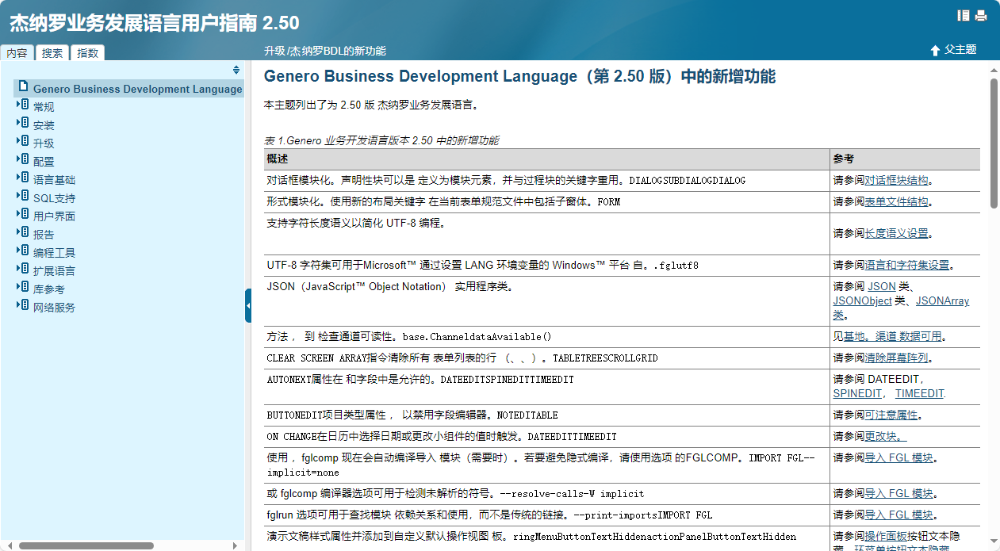
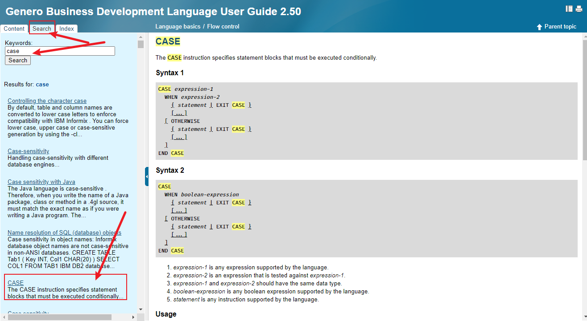

网页版无2.40版本手册，最早只有2.50版本，有更新的版本[LINK](https://4js.com/download/documentation/) 3.10 和4.00版本，方便查询，但是语法很多不支持不建议使用。

这里只介绍[2.50版本手册](https://4js.com/online_documentation/fjs-fgl-2.50.02-manual-html/index.html)。

- 链接打开即为BDL语法总览，这里可以根据菜单浏览所有BDL语法。

- **翻译**：网页版比安装版本有一个好处是可以使用网页翻译为中文。

### Chrome浏览器翻译

  在地址栏最右侧点击翻译图标，或者在网页空白处右键，点击翻译为中文。

  

  

### Edge浏览器翻译

  右键空白处点击翻译为中文

  

  

- **搜索**：通过Search选项搜索，Index选项的搜索没有Search准确

