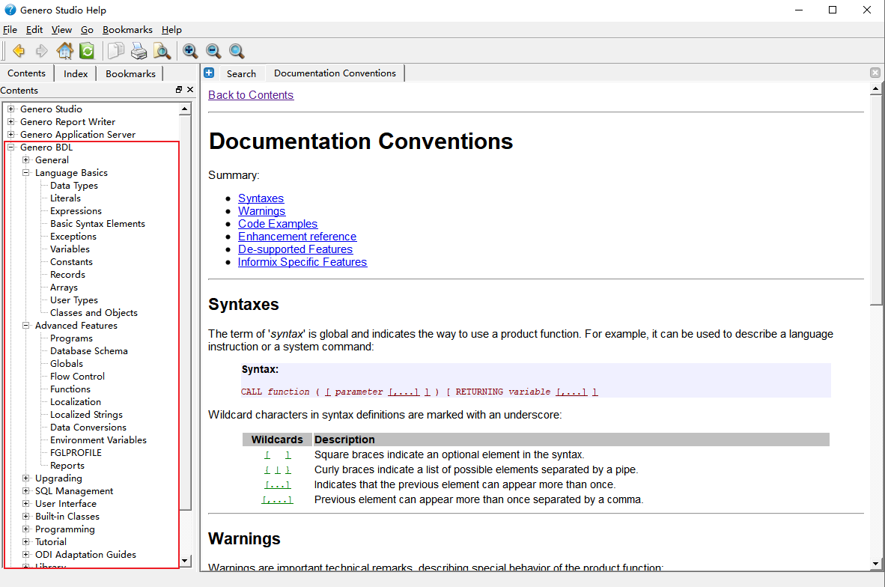
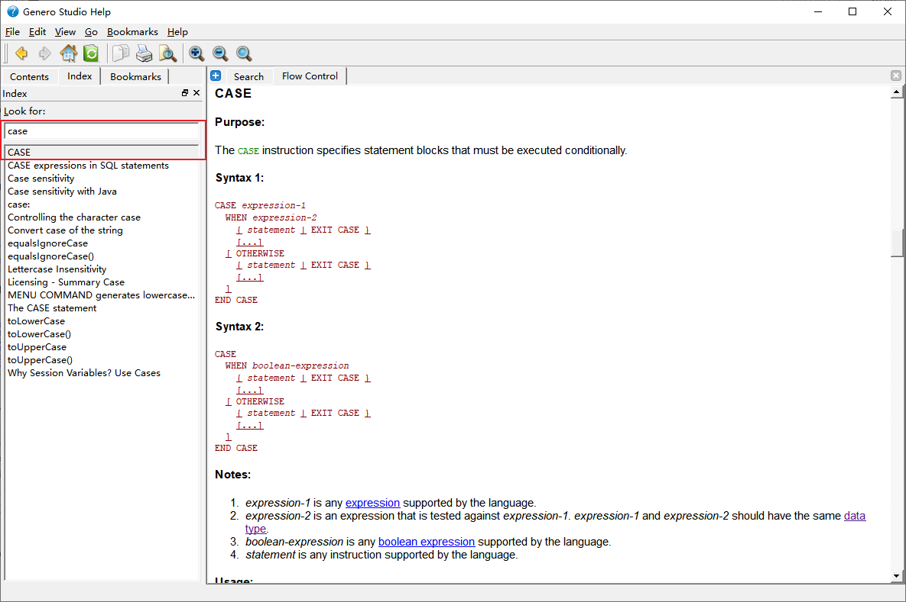
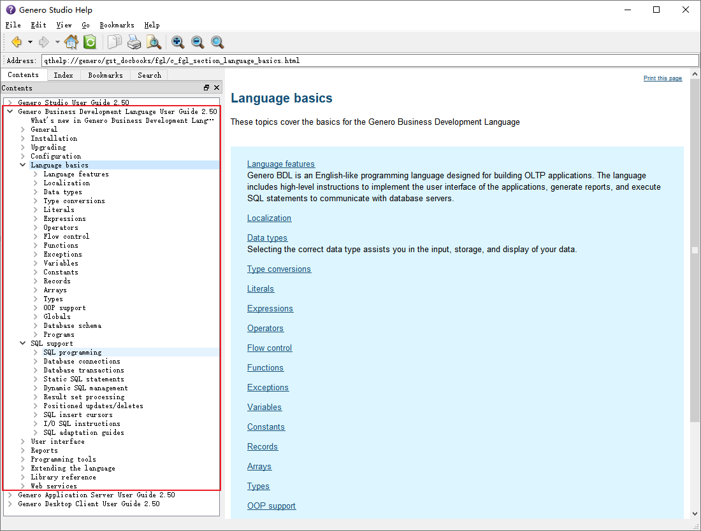
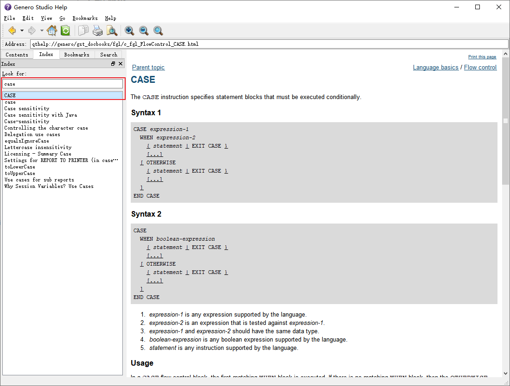

### 2.40 版本

  - 总览，在Contents中，Genero BDL菜单下为BDL语法的主要内容，可以浏览BDL所有语法

    

  - 在Index中，可以选择搜索关键字到达指定页面

    

### 2.50 版本

  - 在2.50版本中，菜单为Genero Business Development Language User Guide 2.50

  

  - Index 中同样可以依据关键字查询

  

### 3.00 版本

