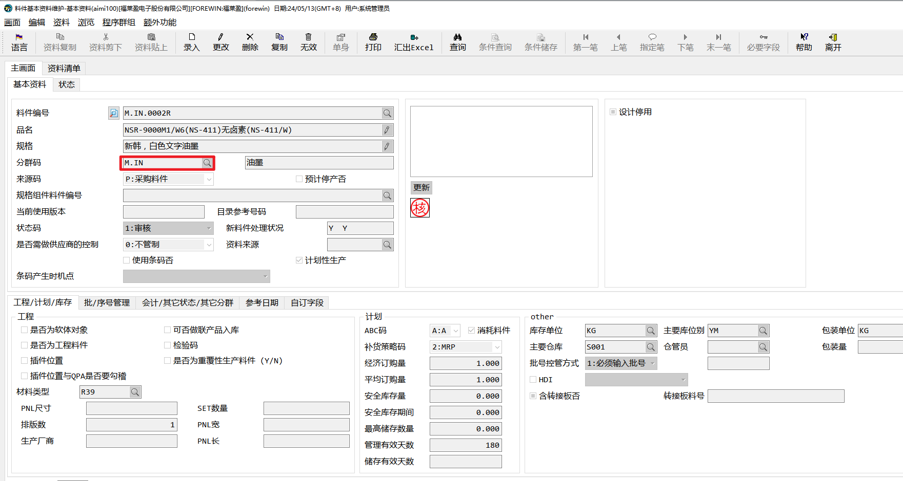
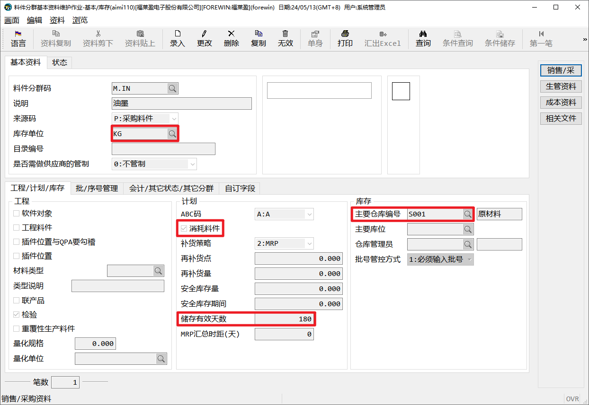
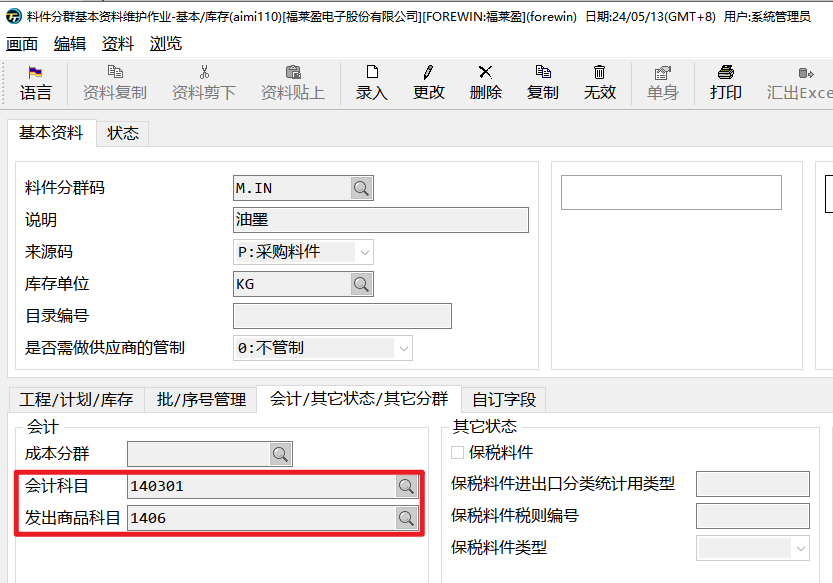
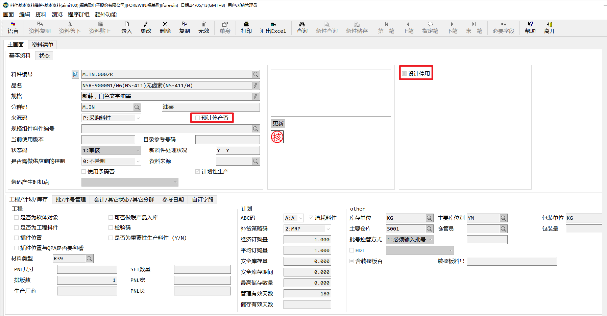
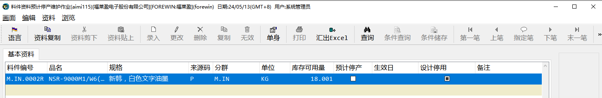

# 基础资料

新增一笔料件，需要维护相当多的参数条件，所以我们将同类的料件归类，建立统一的分群码。如油墨、干膜等。同一个分群码的料件拥有相同的属性，可能单位一致、名称类似、仓库相同、甚至保质期相同。

## 分群码-*aimi110*

如果新增分群码，我们要确认以上栏位是否设置正确，因为之后此分群码料件的默认参数将由此作业带出。

**分群码和料件的会计科目、发出商品科目由财务提供，请勿随意修改。**

## 料件基础资料-*aimi****100***

料件除了分群码还有一个来源码，来源码用来区分此料件会通过什么方式入库，主要使用一下三种：

- P:采购料件：料件只会通过采购入库方式入库

- S:委外加工料件：料件会通过委外采购、工单自制的方式入库

- M:自制料件：料件会通过工单自制的方式入库，也允许采购入库方式入库

停产和停用标记分表标记料件的不同状态、可以通过此状态限制物料哪些操作不可用，***aimi115***此作业可以整批管理料件停产、停用状态：

- 预计停产否：不可采购、自制料件不可开立工单

- 设计停用：不可建立BOM、不可建立工艺资料

## 单位换算管理

特殊料件可能需要多个单位，如油墨，再采购时使用KG，但在工单中，因为KG单位太大，小数位数太长，所以可能同时使用G作为生产单位。

### ***aooi102 *****通用单位换算管理**

在此作业中，可以维护通用的单位换算，如1KG=1000G，1L=1000ML。

### ***aooi103***** 料件单位换算管理**

如果某些特殊料件，单位换算不固定，如1瓶=2KG，1卷=500PCS。可以在此作业中根据料件维护单位换算关系。

