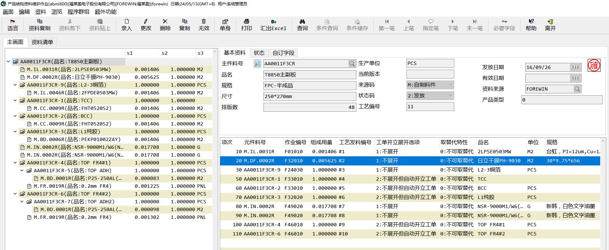
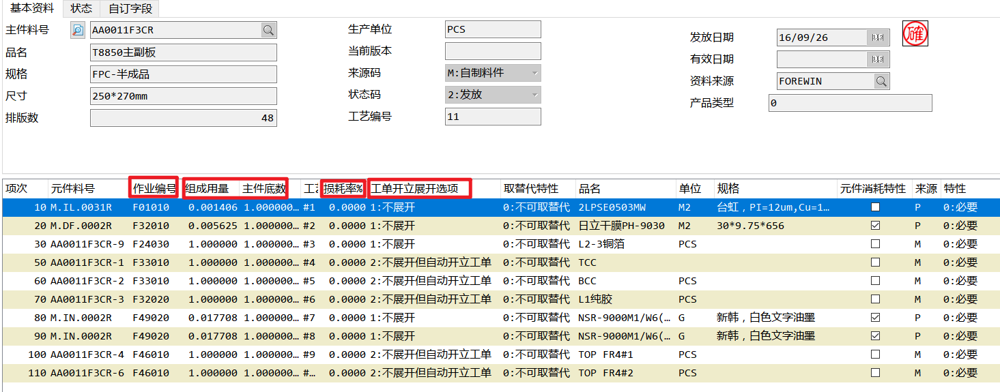
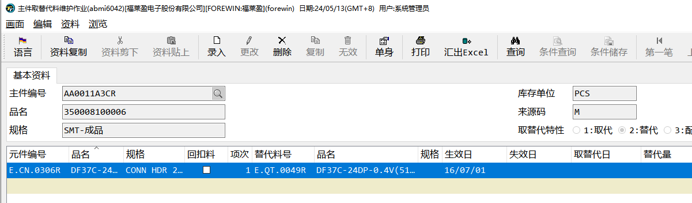
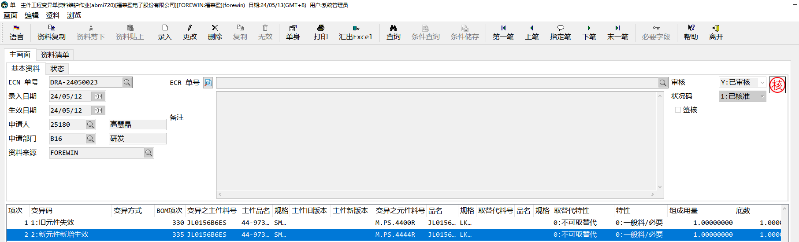

# BOM资料维护

BOM是由主键料号和元件料号组成的层级结构。其中主键料号是成品或半成品、元件料号是半成品或原材料。

## 新增BOM资料-*abmi600*

建立BOM资料时，既可以由原材料向上设计，也可以由成品向下设计。

BOM中可以维护的参数有：

- **作业编号**：作业编号对应工艺资料中的作业编号，维护此编号来确认工艺中每步需要发料的料号

- **组成用来、主键底数**：每个成品数量（生产单位）需要用组成用量/主键底数个元件料号。

- **损耗率**：每次生产时损耗的原件比例，最终需要的元件数量为 生产套数*（1+损耗率）*组成用量/主键底数

- **工单展开选项**：

  - **不展开：**不展开，如果是半成品，则展开到半成品就结束

  - **不展开但自动开立工单：**母工单展开到半成品，然后开立半成品的子工单

  - **展开：**自动将半成品的BOM展开到母工单

  - **开窗询问是否展开：**有用户选择是否展开

**BOM中的消耗特性会影响工单中的元件是否是消耗性料件。**

## 取替代料维护-*abmi6042*

如果某些元件料号不再使用了，先采购进一批新的料号，但库存中仍存在旧的元件，这个时候就需要维护取替代关系，让仓库将合适的料号发出。

在此作业中，可以维护某个主键料号下的某个元件料号可以用哪个元件取替代，维护好之后，在工单之中就可以灵活将此元件取替换为想要更换的原件。

- **取代**：副料替代主料，默认优先发副料

- **替代**：旧料取代新料，默认有限发新料

## BOM变更-*abmi720*

BOM的主键料号在已开立工单之后，就不允许还原了。所以当有某些内容需要修改的时候，需要用到BOM变更，BOM变更只能审核发放，不能取消。当做了错误的资料，需要再继续做一张变更单，重新变更为正确的资料。

