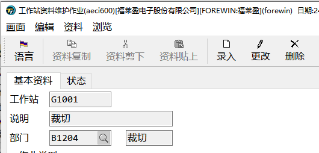

# 工艺资料维护

工艺资料不是生产的必要资料，但是如果要管控生产中每个步骤的明细，工艺是必要的基础资料。工艺资料与BOM是一一对应的。

工艺资料是由BOM的主键料号+工艺编号进行维护的。

## 作业编号维护-*aeci620*

工艺资料就是由多个作业编号组合起来的流程资料。

在作业编号资料维护中，你可以维护一下参数：

- **工作站**：每个作业编号都归属于一个工作站，一个工作站包含多个作业编号

- **检验否**：勾选后需要检验

- **报工否**：勾选后需要报工才会到下一道工序

## 工作站维护-*aeci600*

工作站可以在此作业中维护，每个工作站需要归属到一个部门。

## 工艺维护-*aeci100
*

