# ERP登陆软件安装

## 软件位置

ERP软件安装地址为：\\192.168.1.252\部门dpt\IT\ERP\APP\fjs-gdc-2.40.21-build4635.80-w32vc90.exe

如果无权限打开，需要请IT人员安装。

## 安装过程

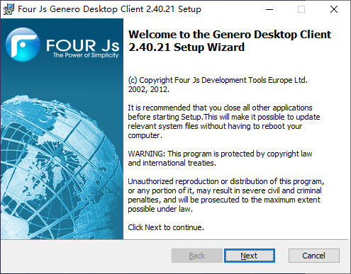

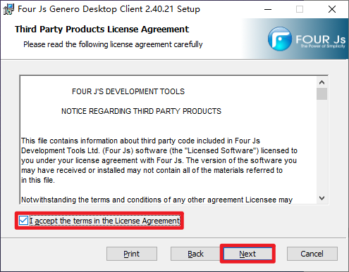

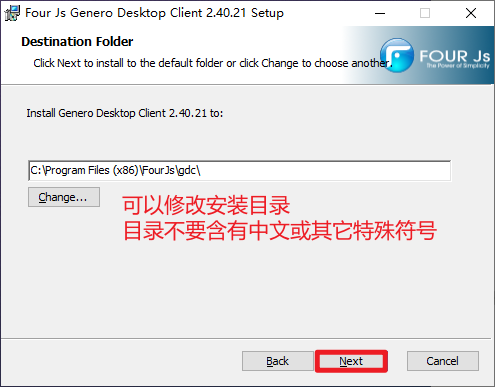

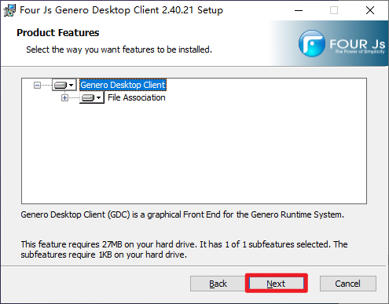

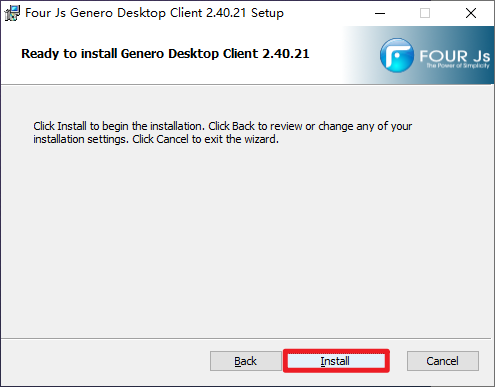

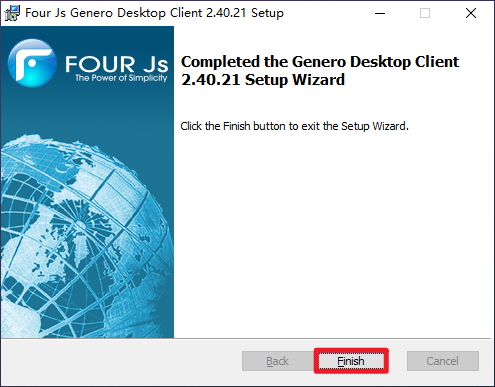

这个时候开始菜单已经增加以下软件图标

# 配置ERP地址

## 将快捷方式放到桌面

右键打开图标文件位置

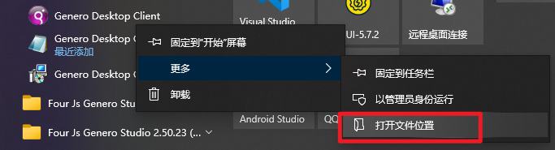

右键/发送到/桌面快捷方式

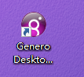

## 增加参数 -a

右键快捷方式图标，打开属性面板

在目标后面输入” -a”，**-a之前有一个空格，**确认后即可配置

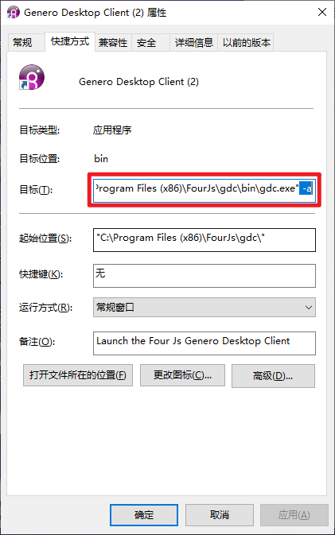

## 配置登陆地址

打开ERP登陆软件，将安全性设置为最低，防止每次连接ERP时弹窗

点击新增配置

name 按照自己喜好命名

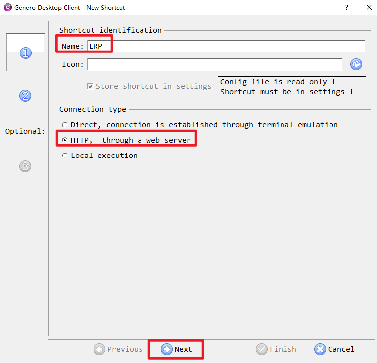

在url中输入地址”[https://192.168.1.19/gas/wa/r/gdc-tiptop-udm-intranet](https://192.168.1.19/gas/wa/r/gdc-tiptop-udm-intranet)”，输入完后点击完成

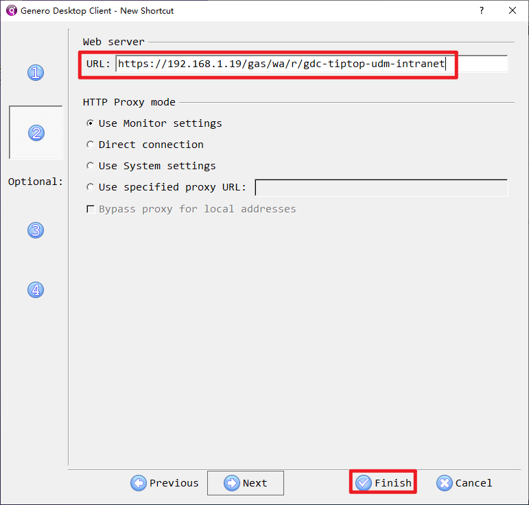

双击新出现的配置地址，或者选中点击Start

出现下面界面输入已申请好的ERP账号密码，登陆即可。

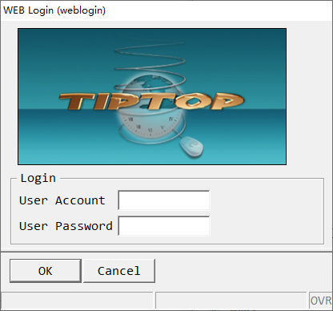

