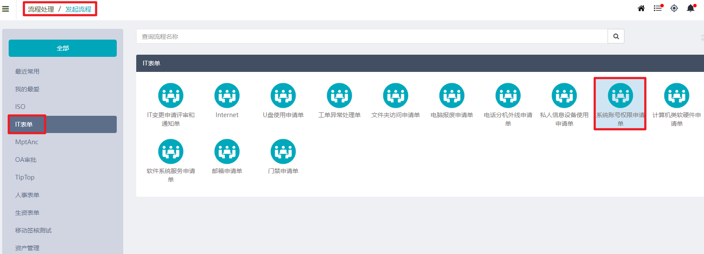
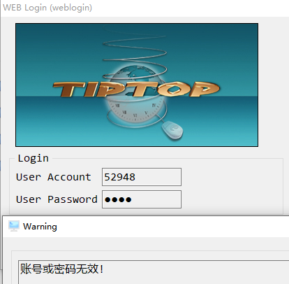

# 账号管理

## ERP账号申请

申请账号必须提供的信息：

1. 申请的账号编号（即工号）

1. 账号的姓名与部门

1. 申请的权限

其中申请的权限描述请参考以下案例：

- 申请52948erp账号，姓名：李晓伟，部门：IT，权限：一般文员

- 申请52948erp账号，姓名：李晓伟，部门：IT，权限：参考账号52900权限

- 申请52948erp账号，姓名：李晓伟，部门：IT，权限：申请录入采购单apmt420、料件查询aimi100、杂项发料单aimt301录入权限

## 忘记密码

密码忘记

连续输入10次错误密码，账号将被锁定，无法登陆

在BPM系统账号权限申请账号重置密码

