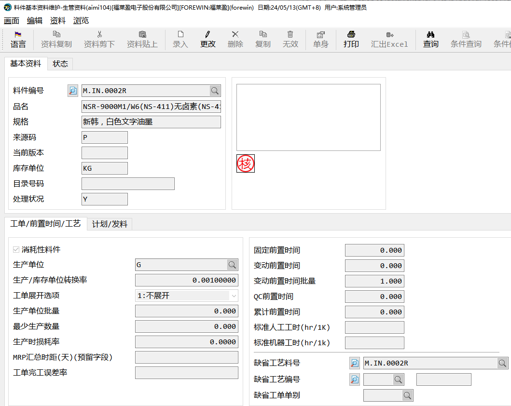

# 生产资料维护

## 分群码维护-*aimi112*

在此作业中，可以按照分群码设置一类料件的默认生产参数。

- **消耗性料件**：勾选后入库后倒扣料

- **生产单位**：BOM默认单位（与库存单位不同时，要先维护好单位换算率）

- **生产单位批量**：每次最少生产的批量

- **最少生产数量**：每次最少生产的数量

- **生产时损耗率**：生产时的默认损耗率

- **发料单位**：工单发料时的默认单位

- **发料单位批量**：每次最少发料的批量

- **最少发料批量**：每次最少发料的数量

## 生管资料维护-*aimi104*

当然还可以在此作业根据料件维护生产参数。

