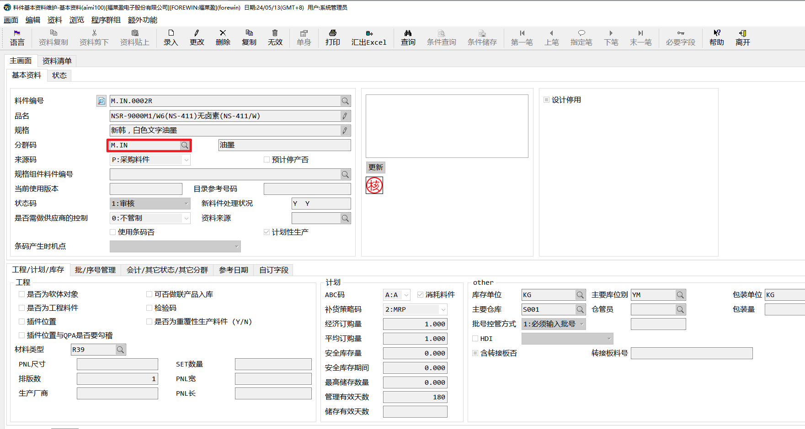
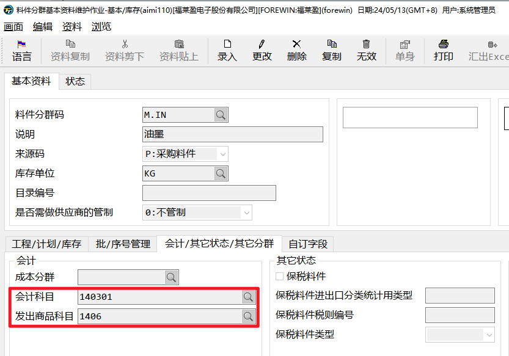
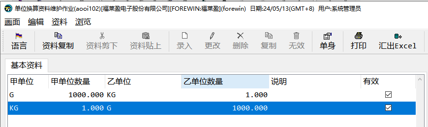

对于设计人员，在ERP中最终产出物是产品的BOM与工艺资料。

我们最先知道是成品料件的属性，然后要确认生产此成品需要用到那些原材料，并设计合理的BOM结构与工艺路线。

# 基础资料

新增一笔料件，需要维护相当多的参数条件，所以我们将同类的料件归类，建立统一的分群码。如油墨、干膜等。同一个分群码的料件拥有相同的属性，可能单位一致、名称类似、仓库相同、甚至保质期相同。

## 分群码-*aimi110*

如果新增分群码，我们要确认以上栏位是否设置正确，因为之后此分群码料件的默认参数将由此作业带出。

**分群码和料件的会计科目、发出商品科目由财务提供，请勿随意修改。**

## 料件基础资料-*aimi****100***

料件除了分群码还有一个来源码，来源码用来区分此料件会通过什么方式入库，主要使用一下三种：

- P:采购料件：料件只会通过采购入库方式入库

- S:委外加工料件：料件会通过委外采购、工单自制的方式入库

- M:自制料件：料件会通过工单自制的方式入库，也允许采购入库方式入库

停产和停用标记分表标记料件的不同状态、可以通过此状态限制物料哪些操作不可用，***aimi115***此作业可以整批管理料件停产、停用状态：

- 预计停产否：不可采购、自制料件不可开立工单

- 设计停用：不可建立BOM、不可建立工艺资料

## 单位换算管理

特殊料件可能需要多个单位，如油墨，再采购时使用KG，但在工单中，因为KG单位太大，小数位数太长，所以可能同时使用G作为生产单位。

### ***aooi102 *****通用单位换算管理**

在此作业中，可以维护通用的单位换算，如1KG=1000G，1L=1000ML。

### ***aooi103***** 料件单位换算管理**

如果某些特殊料件，单位换算不固定，如1瓶=2KG，1卷=500PCS。可以在此作业中根据料件维护单位换算关系。

# 生产资料维护

## 分群码维护-*aimi112*

在此作业中，可以按照分群码设置一类料件的默认生产参数。

- **消耗性料件**：勾选后入库后倒扣料

- **生产单位**：BOM默认单位（与库存单位不同时，要先维护好单位换算率）

- **生产单位批量**：每次最少生产的批量

- **最少生产数量**：每次最少生产的数量

- **生产时损耗率**：生产时的默认损耗率

- **发料单位**：工单发料时的默认单位

- **发料单位批量**：每次最少发料的批量

- **最少发料批量**：每次最少发料的数量

## 生管资料维护-*aimi104*

当然还可以在此作业根据料件维护生产参数。

# BOM资料维护

BOM是由主键料号和元件料号组成的层级结构。其中主键料号是成品或半成品、元件料号是半成品或原材料。

## 新增BOM资料-*abmi600*

建立BOM资料时，既可以由原材料向上设计，也可以由成品向下设计。

BOM中可以维护的参数有：

- **作业编号**：作业编号对应工艺资料中的作业编号，维护此编号来确认工艺中每步需要发料的料号

- **组成用来、主键底数**：每个成品数量（生产单位）需要用组成用量/主键底数个元件料号。

- **损耗率**：每次生产时损耗的原件比例，最终需要的元件数量为 生产套数*（1+损耗率）*组成用量/主键底数

- **工单展开选项**：

  - **不展开：**不展开，如果是半成品，则展开到半成品就结束

  - **不展开但自动开立工单：**母工单展开到半成品，然后开立半成品的子工单

  - **展开：**自动将半成品的BOM展开到母工单

  - **开窗询问是否展开：**有用户选择是否展开

**BOM中的消耗特性会影响工单中的元件是否是消耗性料件。**

## 取替代料维护-*abmi6042*

如果某些元件料号不再使用了，先采购进一批新的料号，但库存中仍存在旧的元件，这个时候就需要维护取替代关系，让仓库将合适的料号发出。

在此作业中，可以维护某个主键料号下的某个元件料号可以用哪个元件取替代，维护好之后，在工单之中就可以灵活将此元件取替换为想要更换的原件。

- **取代**：副料替代主料，默认优先发副料

- **替代**：旧料取代新料，默认有限发新料

## BOM变更-*abmi720*

BOM的主键料号在已开立工单之后，就不允许还原了。所以当有某些内容需要修改的时候，需要用到BOM变更，BOM变更只能审核发放，不能取消。当做了错误的资料，需要再继续做一张变更单，重新变更为正确的资料。

# 工艺资料维护

工艺资料不是生产的必要资料，但是如果要管控生产中每个步骤的明细，工艺是必要的基础资料。工艺资料与BOM是一一对应的。

工艺资料是由BOM的主键料号+工艺编号进行维护的。

## 作业编号维护-*aeci620*

工艺资料就是由多个作业编号组合起来的流程资料。

在作业编号资料维护中，你可以维护一下参数：

- **工作站**：每个作业编号都归属于一个工作站，一个工作站包含多个作业编号

- **检验否**：勾选后需要检验

- **报工否**：勾选后需要报工才会到下一道工序

## 工作站维护-*aeci600*

工作站可以在此作业中维护，每个工作站需要归属到一个部门。

## 工艺维护-*aeci100
*

# 整批复制与审核

