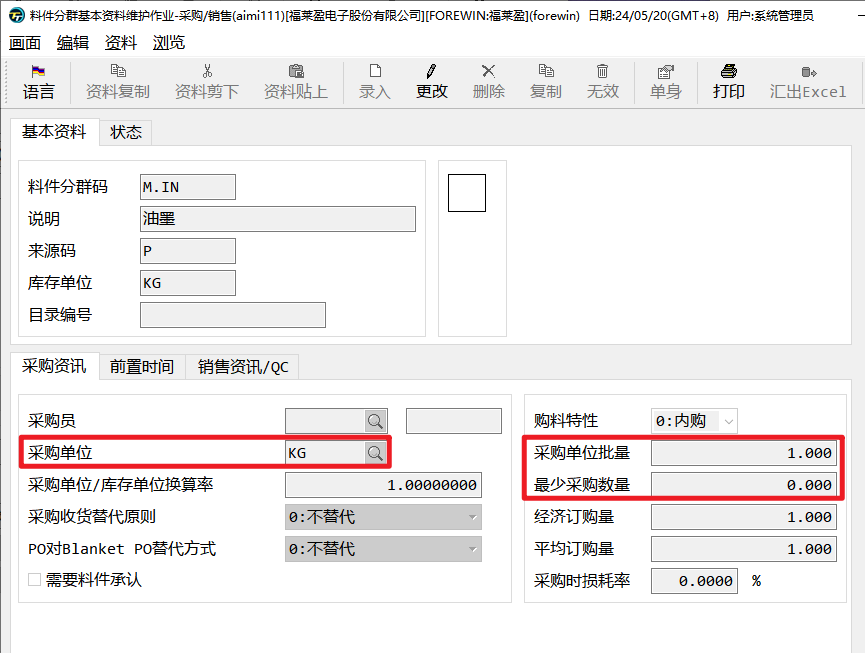
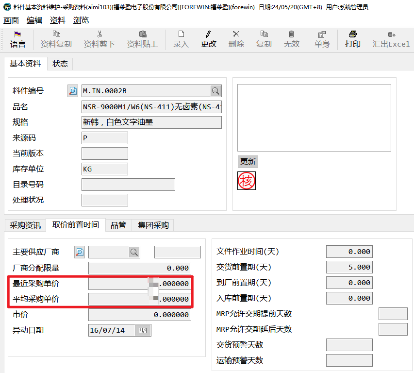
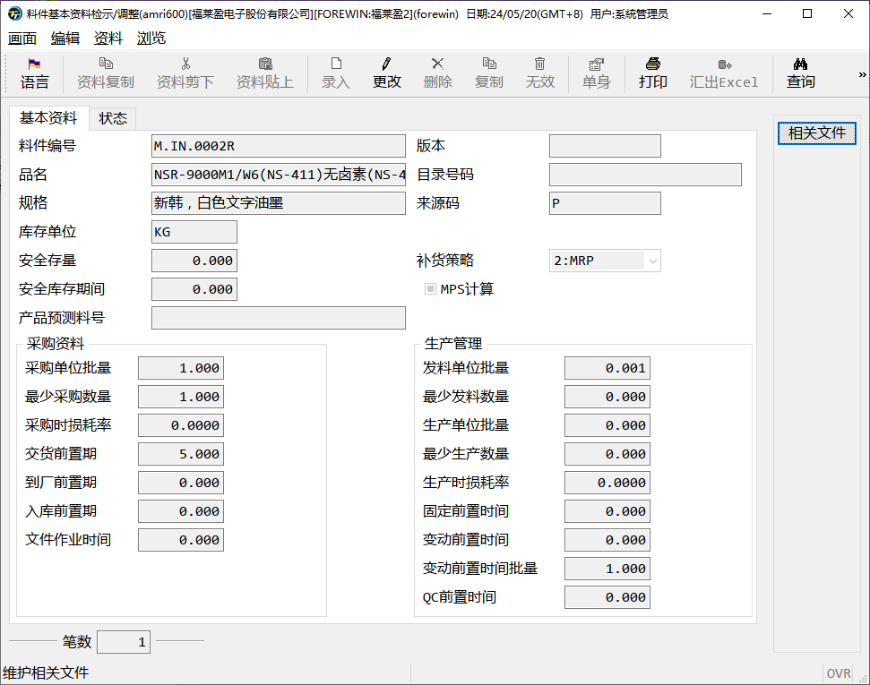

# 采购

## 采购分群码基础资料-*aimi111*

- **采购单位**：请采购默认单位

- **采购单位批量**：请采购批量

- **最少采购数量**：请采购最少采购数量

## 采购基础资料-*aimi103*

- **平均采购单价**：每次采购更新平均单价

- **最近采购单价**：每次采购更新最后一次采购单价

# 物控-MRP

- 安全库存

- 补货策略

- 采购单位批量

- 最少采购数量

- 采购损耗率

- 交货前置期

- 到厂前置期

- 入库前置期

- 发料单位批量

- 最少发料数量

- 生产单位批量

- 最少生产数量

- 生产损耗率

