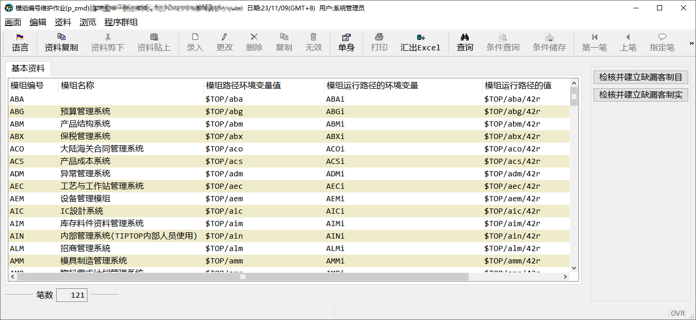

## 模组清单

模组看起来很多，常用的只有下面几个：

    

        AAP 应付账款

    

        ABM  产品结构系统 产品BOM结构

    

        AEC  工艺与工作站系统  产品的工艺资料

    

        AGL 总账会计

    

        AIM  库存料件资料管理系统

    

        AOO 整体系统管理

    

        APM 采购管理

    

        ANM 票据资金

    

        AQC 质量管理

    

        ASF  生产管理

    

        AWS 集成管理

    

        AXC 成本管理

    

        AXM 销售管理

    

        AXR  应收账款

    

        AZZ  系统管理

    

        SUB   一般副程序

    

        LIB 公用程序

    

        GAP 应付账款管理系统大陆版

模组编号A变为C，就变成了客制模组，客制添加的作业一般在客制模组。

如果模组第一个字母不是A，是直接加C，如CSUB、CLIB、CGAP。

## 作业类型编码

不同类型的作业可以分为以下几类：

- 单档录入作业：i

- 单档参数作业：s

- 双档录入作业：t

- 查询作业：q

- 报表作业：r

- 批处理作业：p

## 程序命名规则

程序一般为4为字母和3为流水码组成。（部分模组为了让开发者更好记住，不是这样命名，如p_zz，p_zx，p_zxw这些都是azz模组下的作业，不按照此命名方式命名）

**例如：**

aooi040  —> aoo是模组的名称，i 是作业类型编号，040 是流水号。

这个作业是aoo整体系统管理模组下的一个单档可录入资料的作业。

## 数据库命名规则

### 数据库表名规则

数据库表名分为**表名**和**固定后缀**两个部分，ERP中所有正式表（在p_zta中注册的表）都有固定的后缀（`_file`）。

- 标准表

    标准表的表名是三位字母，这是鼎捷出场就建立好的表。我们不会去动这些表名。

    如工单单头表名：sfb_file

- 客制表

    后续客制添加的表名是以`tc_` **固定前缀**，和**三位字母**加上**固定的后缀**`_file` 组成的。

    例如你要客制一个表，可以用`tc_sfb_file`，这样的方式命名。其中`tc_`与`_file`都是固定的只有三位字母需要自己取名。

### 数据库表字段规则

数据库的表字段也是由两部分组成 **表名**+**流水码。**

- 标准表的标准字段

    流水码一般为2为流水码，有时候字段多，可以用多维流水码或者字母，这个限制不是太死。一般是2位流水码。

    例如：工单单号字段` sfb01`，看名称**sfb**就是表名，这个字段是`sfb_file`表的一个字段，`01`是流水码。

- 标准表的客制字段

    如果标准表中的字段不够用，可以增加字段，增加的字段叫做客制字段。

    客制字段需要在字段前加**固定前缀****`ta_`**，例如：`sfb_file`表中增加客制字段用来记录备注，可以命名为`ta_sfb01`

- 客制表的字段

    客制表的字段也是**表名**+**流水码**，例如`tc_sfb01`，`tc_sfb02`

- 字段 undefine

    在标准表中有一些定义了但是没有使用的字段，例如：`sfbud01`，`sfbud02`，这些字段定义了但是没有存储数据，我们后面可以使用这些字段。

    当ud字段数量不够时，可以在增加`ta_sfb01`，`ta_sfb02`这些客制字段。

