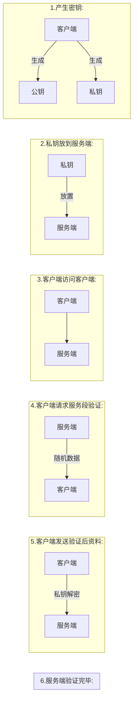

-  产生ssh密钥

```shell
#产生ssh密钥
>  ssh-keygen
Generating public/private rsa key pair.
Enter file in which to save the key (C:\Users\darcy/.ssh/id_rsa):
Enter passphrase (empty for no passphrase):
Enter same passphrase again:
Your identification has been saved in C:\Users\darcy/.ssh/id_rsa
Your public key has been saved in C:\Users\darcy/.ssh/id_rsa.pub
The key fingerprint is:
SHA256:NezN7f4OQQ183iHvX17y6QLijOTIDoWzhozgvo/tras darcy@darcy
The key's randomart image is:
+---[RSA 3072]----+
|             ..  |
|         .   ..+.|
|          +   +o+|
|    .    o + o .o|
|.  o .  S . o +  |
|= . +  . . . ..oo|
|.+ +. + + . . o+=|
|. + oo o o   o o+|
| E=*+o        ++o|
+----[SHA256]-----+
```


