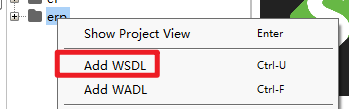
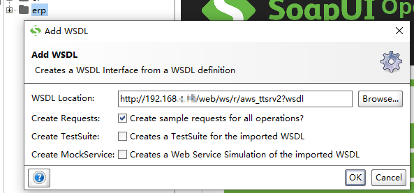
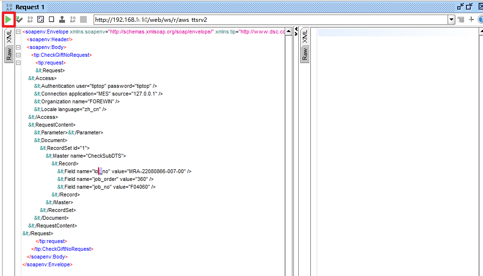
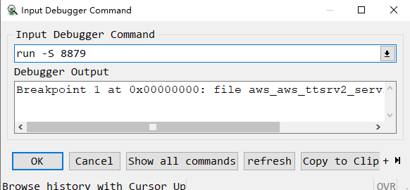

# 接口的DEBUG

## 前提

普通作业的debug你已经会使用，后面会出一篇普通debug的使用。

## 事先准备

下载可以抛砖测试的api测试软件，如soapui、postman这些软件，只要能抛转都可以用。

tiptop gp 的webservice 建议使用soapui比较方便，T100的Restful使用postman比较方便。

## 软件配置

点击OK后，系统会自动产生对应的接口信息，如果未产生，请检查接口服务是否启动

## soap ui使用

点击你要测试的接口

ERP函数名称和接口名称对应关系可以在aws_ttcfg2中查到

这里要注意的是，`<`要替换为`&lt; ` `<![CDATA[…]]> `中的`< `不需要替换，因为已经转义过一次

点击运行，就能模拟一次正常的接口请求。

## DEBUG ERP程序

### 指定断点

ERP的webservice程序为aws_ttsrv2，做过客制的话有可能是其它作业。

和正常作业一样，我们使用r.d2+ aws_ttsrv2进入到debug页面

我们在debug命令窗口，指定我们想要停止的断点，一般用我们需要停止的函数做断点即可。

### 指定端口

断点指定好之后，我们需要指定一个端口用来测试，端口编号只要没有被占用即可

点击OK之后，我们就进入到了等待服务需求状态，这个时候debug会一直转圈等待。

## soap ui指定端口

我们将soap ui中的地址改为和debug一致的端口，然后点击提交。

这个时候debug会进入到断点处，我们开始和正常程序一样debug即可。如果需要重新抛转，在debug中点击允许，soap ui重新抛转一次，就可以在回到断点处。

